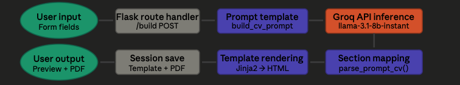
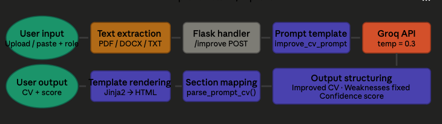
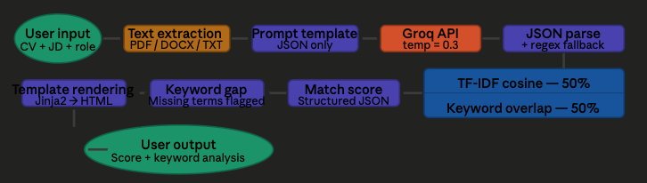
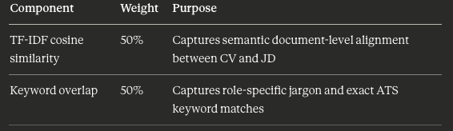
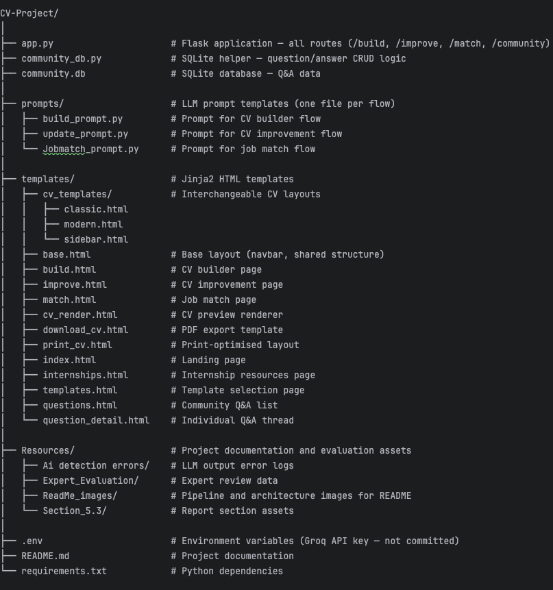
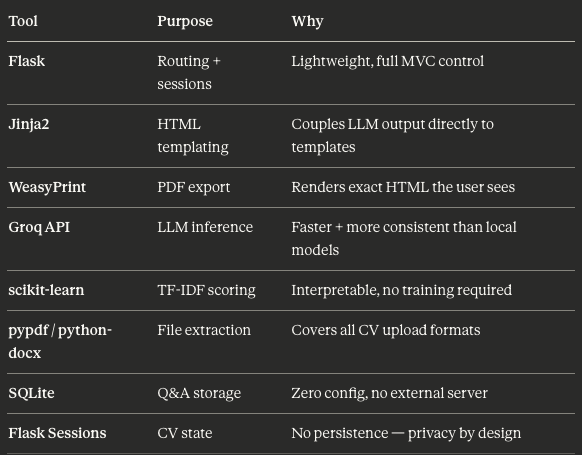

# AI-Powered CV Builder: https://axa2135-project.onrender.com

An intelligent web application that helps graduate and early-career candidates build,
improve, and optimise their CVs using large language models — with ATS-friendly formatting and structured, reliable outputs.

# Project Overview

This project addresses a core question in applied AI:
"How can large language models be integrated into a web application to assist CV creation and improvement in a reliable, 
structured, and user-controlled way?"

Rather than a simple text generator, this system acts as a guided assistant that enforces formatting constraints, prevents hallucination, 
and delivers structured outputs suitable for professional and ATS use.
Project Aims, Core Requirements, and Iterative Improvements

# Features --- Description

CV Builder --- Build a CV from scratch using structured form inputs
CV Improver --- Upload or paste a CV and improve it for a target role
Job Matcher --- Score your CV against a job description with keyword analysis
Template Switcher --- Switch between Modern, Classic, and Sidebar layouts without re-generating
PDF Export --- Download your CV as a pixel-perfect PDF matching the on-screen preview
Copy to Clipboard --- One-click copying of CV output
File Upload --- Supports PDF, DOCX, and TXT input formats
Community Q&A --- Lightweight SQLite-powered career support forum

#  System Architecture & Pipelines

The system is built around three core flows, each handling a distinct user task. All flows share a common backbone -
Flask route handling, Groq API inference at temp=0.3, and Jinja2 template rendering — but differ in their input handling and output structuring logi 

## Build-Flow

Stage                   Description
User input              Structured form fields collected from the frontend 
Flask route handler     /build POST route receives and validates form data
Prompt template         build_cv_prompt() populates a predefined prompt with user data and system rules
Groq API inference      llama-3.1-8b-instant generates raw CV text at temp=0.3
Section mapping         parse_prompt_cv() maps LLM output into structured CV sections
Template rendering      Jinja2 renders the parsed CV into the selected HTML template
User output             CV displayed for preview, with session saved for template switching and PDF export

## Improve-Flow

Stage                   Description
User input              CV uploaded (PDF / DOCX / TXT) or pasted, plus a target role
Flask route handler     /improve POST route handles input and triggers the pipeline
Prompt template         improve_cv_prompt() constructs the prompt with constraints and contact line enforcement
Groq API inference      LLM rewrites the CV at temp=0.3 with structured output enforcement
Output structuring      Response split into three components: improved CV block, weaknesses fixed, and confidence score
Section mapping         parse_prompt_cv() maps the improved CV into template-compatible sections
Template rendering      Jinja2 renders the result into the selected layout
User output             Improved CV, weaknesses, and confidence score displayed; session persisted for template switching

## Job match-Flow

Stage                   Description
User input              CV and job description uploaded or pasted, plus a target role
Prompt template         match_cv_prompt() enforces JSON-only output
Groq API inference      LLM extracts alignment signals at temp=0.3
JSON parse              json.loads() with regex fallback extracts valid JSON from the response
Hybrid scoring          Match score computed as 50% TF-IDF cosine similarity + 50% keyword overlap
Match score             Final score returned as structured JSON with alignment breakdown
Keyword gap analysis    Missing terms and skill gaps flagged for the user
Template rendering      Results rendered into the match results template via Jinja2
User output             Match score, keyword analysis, and improvement suggestions displayed

## Hybrid scoring model
The job match score combines two complementary signals:
Final score = (TF-IDF cosine similarity × 0.50) + (Keyword overlap × 0.50)

NOTE: there is a pipeline from Job Match to Improve CV, to Maximize Easy User Interface

# Code Structure

# Key design decisions
Separation of prompts from routes — each flow has its own prompt file in prompts/
This keeps app.py clean and makes prompt iteration independent of routing logic.

CV templates as pure presentation — the cv_templates/ subfolder contains only layout HTML.
LLM output is parsed and injected by app.py and Jinja2, meaning templates never contain logic.

No CV persistence — Flask sessions carry state between routes but nothing is written to community.db or any file.
CV data exists only in memory for the duration of the session.

Single entry point — all routes live in app.py, keeping the application simple and easy to trace for an academic prototype.

# Tech Stack
